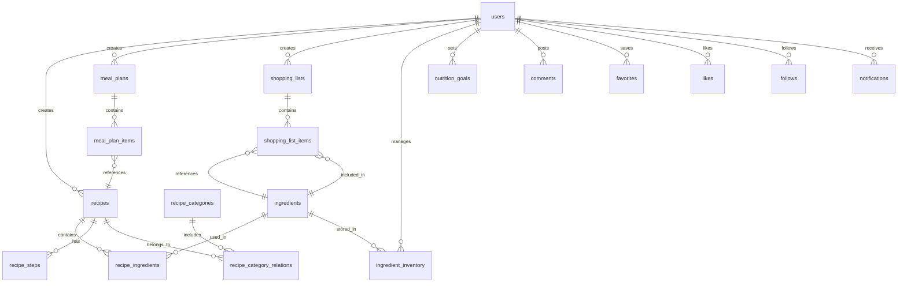

# 家庭食谱与膳食计划应用数据库设计文档

## 1. 数据库概述

### 1.1 数据库设计目标
本文档旨在详细说明家庭食谱与膳食计划应用的数据库设计，包括表结构、字段定义、表间关系、索引设计等，确保数据库设计满足应用的功能需求和性能要求，同时保证数据的完整性和安全性。

### 1.2 数据库选型
- **数据库类型**：关系型数据库
- **具体产品**：SQLite 3
- **选型理由**：SQLite是轻量级的嵌入式关系型数据库，无需独立服务器，适合桌面应用本地存储。它支持ACID事务、外键约束、复杂查询，具有零配置、跨平台、数据文件单一等特点，非常适合家庭食谱与膳食计划应用的本地数据存储需求。

### 1.3 字符集与排序规则
- **默认字符集**：UTF-8
- **排序规则**：默认BINARY或通过COLLATE子句指定
- **选择理由**：SQLite默认以UTF-8编码存储字符串数据，支持Unicode字符集，包括表情符号。SQLite的排序规则更加灵活，可以在查询时动态指定。

## 2. 数据库表结构设计

### 2.1 用户表（users）

| 字段名 | 数据类型 | 约束 | 描述 |
| :--- | :--- | :--- | :--- |
| `user_id` | `INTEGER` | `PRIMARY KEY AUTOINCREMENT` | 用户ID |
| `username` | `VARCHAR(50)` | `UNIQUE NOT NULL` | 用户名 |
| `password` | `VARCHAR(255)` | `NOT NULL` | 密码（加密存储） |
| `email` | `VARCHAR(100)` | `UNIQUE` | 邮箱 |
| `phone` | `VARCHAR(20)` | `UNIQUE` | 手机号 |
| `avatar` | `VARCHAR(255)` | | 头像URL |
| `gender` | `TEXT` | | 性别（'male', 'female', 'other'） |
| `age` | `INTEGER` | | 年龄 |
| `height` | `REAL` | | 身高（cm） |
| `weight` | `REAL` | | 体重（kg） |
| `dietary_preference` | `TEXT` | | 饮食偏好（JSON格式） |
| `health_goal` | `TEXT` | | 健康目标（JSON格式） |
| `allergies` | `TEXT` | | 过敏原（JSON格式） |
| `created_at` | `DATETIME` | `DEFAULT CURRENT_TIMESTAMP` | 创建时间 |
| `updated_at` | `DATETIME` | `DEFAULT CURRENT_TIMESTAMP` | 更新时间 |
| `last_login_at` | `DATETIME` | | 最后登录时间 |
| `status` | `TEXT` | `DEFAULT 'active'` | 用户状态（'active', 'inactive', 'blocked'） |

### 2.2 食谱表（recipes）

| 字段名 | 数据类型 | 约束 | 描述 |
| :--- | :--- | :--- | :--- |
| `recipe_id` | `INTEGER` | `PRIMARY KEY AUTOINCREMENT` | 食谱ID |
| `user_id` | `INTEGER` | `NOT NULL, REFERENCES users(user_id)` | 创建者ID |
| `title` | `VARCHAR(100)` | `NOT NULL` | 标题 |
| `description` | `TEXT` | | 描述 |
| `cover_image` | `VARCHAR(255)` | | 封面图片URL |
| `prep_time` | `INTEGER` | `NOT NULL` | 准备时间（分钟） |
| `cook_time` | `INTEGER` | `NOT NULL` | 烹饪时间（分钟） |
| `total_time` | `INTEGER` | `NOT NULL` | 总时间（分钟） |
| `servings` | `INTEGER` | `NOT NULL` | 份数 |
| `difficulty` | `TEXT` | `DEFAULT 'medium'` | 难度（'easy', 'medium', 'hard'） |
| `cuisine_type` | `VARCHAR(50)` | | 菜系类型 |
| `is_public` | `INTEGER` | `DEFAULT 1` | 是否公开（0/1） |
| `is_featured` | `INTEGER` | `DEFAULT 0` | 是否精选（0/1） |
| `view_count` | `INTEGER` | `DEFAULT 0` | 浏览次数 |
| `like_count` | `INTEGER` | `DEFAULT 0` | 点赞次数 |
| `comment_count` | `INTEGER` | `DEFAULT 0` | 评论次数 |
| `created_at` | `DATETIME` | `DEFAULT CURRENT_TIMESTAMP` | 创建时间 |
| `updated_at` | `DATETIME` | `DEFAULT CURRENT_TIMESTAMP` | 更新时间 |
| `status` | `TEXT` | `DEFAULT 'draft'` | 食谱状态（'draft', 'published', 'archived'） |

### 2.3 食谱分类表（recipe_categories）

| 字段名 | 数据类型 | 约束 | 描述 |
| :--- | :--- | :--- | :--- |
| `category_id` | `INTEGER` | `PRIMARY KEY AUTOINCREMENT` | 分类ID |
| `name` | `VARCHAR(50)` | `UNIQUE NOT NULL` | 分类名称 |
| `description` | `TEXT` | | 分类描述 |
| `icon` | `VARCHAR(50)` | | 分类图标 |
| `created_at` | `DATETIME` | `DEFAULT CURRENT_TIMESTAMP` | 创建时间 |

### 2.4 食谱-分类关联表（recipe_category_relations）

| 字段名 | 数据类型 | 约束 | 描述 |
| :--- | :--- | :--- | :--- |
| `recipe_id` | `INTEGER` | `NOT NULL, REFERENCES recipes(recipe_id), PRIMARY KEY` | 食谱ID |
| `category_id` | `INTEGER` | `NOT NULL, REFERENCES recipe_categories(category_id), PRIMARY KEY` | 分类ID |

### 2.5 食材表（ingredients）

| 字段名 | 数据类型 | 约束 | 描述 |
| :--- | :--- | :--- | :--- |
| `ingredient_id` | `INTEGER` | `PRIMARY KEY AUTOINCREMENT` | 食材ID |
| `name` | `VARCHAR(100)` | `NOT NULL` | 食材名称 |
| `category` | `VARCHAR(50)` | `NOT NULL` | 食材类别 |
| `unit` | `VARCHAR(20)` | | 计量单位 |
| `calories` | `REAL` | `DEFAULT 0` | 热量（每100g） |
| `protein` | `REAL` | `DEFAULT 0` | 蛋白质含量（每100g） |
| `fat` | `REAL` | `DEFAULT 0` | 脂肪含量（每100g） |
| `carbohydrate` | `REAL` | `DEFAULT 0` | 碳水化合物含量（每100g） |
| `fiber` | `REAL` | `DEFAULT 0` | 膳食纤维含量（每100g） |
| `vitamins` | `TEXT` | | 维生素含量（JSON格式） |
| `minerals` | `TEXT` | | 矿物质含量（JSON格式） |
| `description` | `TEXT` | | 食材描述 |
| `created_at` | `DATETIME` | `DEFAULT CURRENT_TIMESTAMP` | 创建时间 |
| `updated_at` | `DATETIME` | `DEFAULT CURRENT_TIMESTAMP` | 更新时间 |

### 2.6 食谱食材表（recipe_ingredients）

| 字段名 | 数据类型 | 约束 | 描述 |
| :--- | :--- | :--- | :--- |
| `recipe_ingredient_id` | `INTEGER` | `PRIMARY KEY AUTOINCREMENT` | 主键ID |
| `recipe_id` | `INTEGER` | `NOT NULL, REFERENCES recipes(recipe_id)` | 食谱ID |
| `ingredient_id` | `INTEGER` | `REFERENCES ingredients(ingredient_id)` | 食材ID |
| `ingredient_name` | `VARCHAR(100)` | `NOT NULL` | 食材名称（冗余存储） |
| `quantity` | `REAL` | `NOT NULL` | 数量 |
| `unit` | `VARCHAR(20)` | `NOT NULL` | 单位 |
| `notes` | `VARCHAR(255)` | | 备注 |

### 2.7 食谱步骤表（recipe_steps）

| 字段名 | 数据类型 | 约束 | 描述 |
| :--- | :--- | :--- | :--- |
| `step_id` | `INTEGER` | `PRIMARY KEY AUTOINCREMENT` | 步骤ID |
| `recipe_id` | `INTEGER` | `NOT NULL, REFERENCES recipes(recipe_id)` | 食谱ID |
| `step_number` | `INTEGER` | `NOT NULL` | 步骤序号 |
| `description` | `TEXT` | `NOT NULL` | 步骤描述 |
| `image_url` | `VARCHAR(255)` | | 步骤图片URL |

### 2.8 膳食计划表（meal_plans）

| 字段名 | 数据类型 | 约束 | 描述 |
| :--- | :--- | :--- | :--- |
| `plan_id` | `INTEGER` | `PRIMARY KEY AUTOINCREMENT` | 计划ID |
| `user_id` | `INTEGER` | `NOT NULL, REFERENCES users(user_id)` | 用户ID |
| `title` | `VARCHAR(100)` | `NOT NULL` | 计划标题 |
| `start_date` | `DATE` | `NOT NULL` | 开始日期 |
| `end_date` | `DATE` | `NOT NULL` | 结束日期 |
| `plan_type` | `TEXT` | `DEFAULT 'week'` | 计划类型（'day', 'week', 'month'） |
| `is_template` | `INTEGER` | `DEFAULT 0` | 是否为模板（0/1） |
| `description` | `TEXT` | | 计划描述 |
| `created_at` | `DATETIME` | `DEFAULT CURRENT_TIMESTAMP` | 创建时间 |
| `updated_at` | `DATETIME` | `DEFAULT CURRENT_TIMESTAMP` | 更新时间 |

### 2.9 计划餐次表（meal_plan_items）

| 字段名 | 数据类型 | 约束 | 描述 |
| :--- | :--- | :--- | :--- |
| `item_id` | `INTEGER` | `PRIMARY KEY AUTOINCREMENT` | 餐次ID |
| `plan_id` | `INTEGER` | `NOT NULL, REFERENCES meal_plans(plan_id)` | 计划ID |
| `meal_date` | `DATE` | `NOT NULL` | 餐次日期 |
| `meal_type` | `TEXT` | `NOT NULL` | 餐次类型（'breakfast', 'lunch', 'dinner', 'snack'） |
| `recipe_id` | `INTEGER` | `REFERENCES recipes(recipe_id)` | 食谱ID |
| `custom_recipe_name` | `VARCHAR(100)` | | 自定义食谱名称（当未关联食谱时） |
| `notes` | `TEXT` | | 备注 |
| `created_at` | `DATETIME` | `DEFAULT CURRENT_TIMESTAMP` | 创建时间 |
| `updated_at` | `DATETIME` | `DEFAULT CURRENT_TIMESTAMP` | 更新时间 |

### 2.10 食材清单表（shopping_lists）

| 字段名 | 数据类型 | 约束 | 描述 |
| :--- | :--- | :--- | :--- |
| `list_id` | `INTEGER` | `PRIMARY KEY AUTOINCREMENT` | 清单ID |
| `user_id` | `INTEGER` | `NOT NULL, REFERENCES users(user_id)` | 用户ID |
| `title` | `VARCHAR(100)` | `NOT NULL` | 清单标题 |
| `is_generated` | `INTEGER` | `DEFAULT 0` | 是否由系统生成（0/1） |
| `source_plan_id` | `INTEGER` | `REFERENCES meal_plans(plan_id)` | 来源计划ID |
| `status` | `TEXT` | `DEFAULT 'draft'` | 清单状态（'draft', 'completed'） |
| `created_at` | `DATETIME` | `DEFAULT CURRENT_TIMESTAMP` | 创建时间 |
| `updated_at` | `DATETIME` | `DEFAULT CURRENT_TIMESTAMP` | 更新时间 |

### 2.11 清单项目表（shopping_list_items）

| 字段名 | 数据类型 | 约束 | 描述 |
| :--- | :--- | :--- | :--- |
| `item_id` | `INTEGER` | `PRIMARY KEY AUTOINCREMENT` | 项目ID |
| `list_id` | `INTEGER` | `NOT NULL, REFERENCES shopping_lists(list_id)` | 清单ID |
| `ingredient_id` | `INTEGER` | `REFERENCES ingredients(ingredient_id)` | 食材ID |
| `ingredient_name` | `VARCHAR(100)` | `NOT NULL` | 食材名称 |
| `quantity` | `REAL` | `NOT NULL` | 数量 |
| `unit` | `VARCHAR(20)` | `NOT NULL` | 单位 |
| `is_purchased` | `INTEGER` | `DEFAULT 0` | 是否已购买（0/1） |
| `category` | `VARCHAR(50)` | | 商品类别（超市分类） |
| `notes` | `VARCHAR(255)` | | 备注 |

### 2.12 食材库存表（ingredient_inventory）

| 字段名 | 数据类型 | 约束 | 描述 |
| :--- | :--- | :--- | :--- |
| `inventory_id` | `INTEGER` | `PRIMARY KEY AUTOINCREMENT` | 库存ID |
| `user_id` | `INTEGER` | `NOT NULL, REFERENCES users(user_id)` | 用户ID |
| `ingredient_id` | `INTEGER` | `REFERENCES ingredients(ingredient_id)` | 食材ID |
| `ingredient_name` | `VARCHAR(100)` | `NOT NULL` | 食材名称 |
| `quantity` | `REAL` | `NOT NULL` | 数量 |
| `unit` | `VARCHAR(20)` | `NOT NULL` | 单位 |
| `expiry_date` | `DATE` | | 过期日期 |
| `storage_location` | `VARCHAR(50)` | | 存储位置 |
| `created_at` | `DATETIME` | `DEFAULT CURRENT_TIMESTAMP` | 创建时间 |
| `updated_at` | `DATETIME` | `DEFAULT CURRENT_TIMESTAMP` | 更新时间 |

### 2.13 营养目标表（nutrition_goals）

| 字段名 | 数据类型 | 约束 | 描述 |
| :--- | :--- | :--- | :--- |
| `goal_id` | `INTEGER` | `PRIMARY KEY AUTOINCREMENT` | 目标ID |
| `user_id` | `INTEGER` | `NOT NULL, UNIQUE, REFERENCES users(user_id)` | 用户ID |
| `daily_calories` | `REAL` | `DEFAULT 2000` | 每日热量目标 |
| `daily_protein` | `REAL` | `DEFAULT 50` | 每日蛋白质目标 |
| `daily_fat` | `REAL` | `DEFAULT 65` | 每日脂肪目标 |
| `daily_carbohydrate` | `REAL` | `DEFAULT 300` | 每日碳水化合物目标 |
| `daily_fiber` | `REAL` | `DEFAULT 25` | 每日膳食纤维目标 |
| `custom_goals` | `TEXT` | | 自定义营养目标（JSON格式） |
| `created_at` | `DATETIME` | `DEFAULT CURRENT_TIMESTAMP` | 创建时间 |
| `updated_at` | `DATETIME` | `DEFAULT CURRENT_TIMESTAMP` | 更新时间 |

### 2.14 评论表（comments）

| 字段名 | 数据类型 | 约束 | 描述 |
| :--- | :--- | :--- | :--- |
| `comment_id` | `INTEGER` | `PRIMARY KEY AUTOINCREMENT` | 评论ID |
| `user_id` | `INTEGER` | `NOT NULL, REFERENCES users(user_id)` | 用户ID |
| `recipe_id` | `INTEGER` | `NOT NULL, REFERENCES recipes(recipe_id)` | 食谱ID |
| `parent_comment_id` | `INTEGER` | `REFERENCES comments(comment_id)` | 父评论ID（用于回复） |
| `content` | `TEXT` | `NOT NULL` | 评论内容 |
| `rating` | `INTEGER` | `DEFAULT 5` | 评分（1-5） |
| `created_at` | `DATETIME` | `DEFAULT CURRENT_TIMESTAMP` | 创建时间 |
| `updated_at` | `DATETIME` | `DEFAULT CURRENT_TIMESTAMP` | 更新时间 |

### 2.15 收藏表（favorites）

| 字段名 | 数据类型 | 约束 | 描述 |
| :--- | :--- | :--- | :--- |
| `favorite_id` | `INTEGER` | `PRIMARY KEY AUTOINCREMENT` | 收藏ID |
| `user_id` | `INTEGER` | `NOT NULL, REFERENCES users(user_id)` | 用户ID |
| `recipe_id` | `INTEGER` | `NOT NULL, REFERENCES recipes(recipe_id)` | 食谱ID |
| `created_at` | `DATETIME` | `DEFAULT CURRENT_TIMESTAMP` | 收藏时间 |

### 2.16 点赞表（likes）

| 字段名 | 数据类型 | 约束 | 描述 |
| :--- | :--- | :--- | :--- |
| `like_id` | `INTEGER` | `PRIMARY KEY AUTOINCREMENT` | 点赞ID |
| `user_id` | `INTEGER` | `NOT NULL, REFERENCES users(user_id)` | 用户ID |
| `recipe_id` | `INTEGER` | `NOT NULL, REFERENCES recipes(recipe_id)` | 食谱ID |
| `created_at` | `DATETIME` | `DEFAULT CURRENT_TIMESTAMP` | 点赞时间 |

### 2.17 关注表（follows）

| 字段名 | 数据类型 | 约束 | 描述 |
| :--- | :--- | :--- | :--- |
| `follow_id` | `INTEGER` | `PRIMARY KEY AUTOINCREMENT` | 关注ID |
| `follower_user_id` | `INTEGER` | `NOT NULL, REFERENCES users(user_id)` | 关注者ID |
| `followed_user_id` | `INTEGER` | `NOT NULL, REFERENCES users(user_id)` | 被关注者ID |
| `created_at` | `DATETIME` | `DEFAULT CURRENT_TIMESTAMP` | 关注时间 |

### 2.18 通知表（notifications）

| 字段名 | 数据类型 | 约束 | 描述 |
| :--- | :--- | :--- | :--- |
| `notification_id` | `INTEGER` | `PRIMARY KEY AUTOINCREMENT` | 通知ID |
| `user_id` | `INTEGER` | `NOT NULL, REFERENCES users(user_id)` | 接收用户ID |
| `sender_user_id` | `INTEGER` | `REFERENCES users(user_id)` | 发送者ID |
| `type` | `TEXT` | `NOT NULL` | 通知类型（'like', 'comment', 'follow', 'system'） |
| `content` | `TEXT` | `NOT NULL` | 通知内容 |
| `related_id` | `INTEGER` | | 相关实体ID（如食谱ID、评论ID等） |
| `is_read` | `INTEGER` | `DEFAULT 0` | 是否已读（0/1） |
| `created_at` | `DATETIME` | `DEFAULT CURRENT_TIMESTAMP` | 创建时间 |

## 3. 表间关系图

## 4. 索引设计

### 4.1 主键索引

所有表的主键（PRIMARY KEY）自动创建索引。

### 4.2 外键索引

为了优化查询性能，在SQLite中为以下外键创建索引：

- `recipes(user_id)`
- `meal_plans(user_id)`
- `shopping_lists(user_id, source_plan_id)`
- `shopping_list_items(list_id, ingredient_id)`
- `meal_plan_items(plan_id, recipe_id)`
- `ingredient_inventory(user_id, ingredient_id)`
- `comments(recipe_id, user_id)`
- `favorites(user_id, recipe_id)`
- `likes(user_id, recipe_id)`
- `follows(follower_user_id, followed_user_id)`
- `notifications(user_id)`
- `nutrition_goals(user_id)`

### 4.3 其他索引

- `recipes(title, created_at)` - 加速食谱名称搜索和时间排序
- `ingredients(name, category)` - 加速食材搜索
- `meal_plans(start_date, end_date)` - 加速膳食计划时间范围查询
- `shopping_lists(status, created_at)` - 加速购物清单状态查询
- `recipe_categories(name)` - 加速食谱分类查询

## 5. 数据完整性约束

### 5.1 实体完整性
- 所有表都定义了主键，确保实体的唯一性
- 在SQLite中，使用INTEGER PRIMARY KEY AUTOINCREMENT确保主键值的自动生成和唯一性

### 5.2 参照完整性
- SQLite外键约束默认禁用，需要在连接时启用：`PRAGMA foreign_keys = ON;`
- 所有外键都设置了适当的参照关系
- 建议设置级联删除或级联更新策略，确保数据一致性
  - 例如：删除用户时，级联删除其相关的食谱、膳食计划等
  - 删除食谱时，级联删除其相关的食材、步骤、评论等

### 5.3 域完整性
- 使用适当的数据类型和约束（如NOT NULL、UNIQUE）确保数据的有效性
- SQLite支持CHECK约束，但在某些旧版本中可能有限制
- 对日期和时间字段设置DEFAULT CURRENT_TIMESTAMP值

## 6. 数据库优化建议

### 6.1 查询优化
- 在SQLite中为常用查询创建适当的索引，特别是WHERE子句和JOIN条件中使用的列
- 避免在WHERE子句中对索引列进行函数操作
- 使用LIMIT限制返回的记录数量，适合桌面应用的分页显示
- 对频繁搜索的文本内容，考虑使用全文搜索扩展

### 6.2 存储优化
- 合理设置数据类型，避免存储空间浪费
- 对于JSON数据（如dietary_preference、vitamins等），使用TEXT类型存储
- 利用SQLite的动态类型特性，但保持表设计一致性

### 6.3 性能优化
- 在桌面应用中缓存常用数据，减少数据库访问频率
- 对于频繁写入的操作，使用事务批量处理以提高性能
- 定期执行VACUUM命令，优化数据库文件大小和性能
- 设置适当的缓存大小：`PRAGMA cache_size = -64000;`（约64MB）

### 6.4 备份与恢复
- 在桌面应用中实现简单的备份功能，将SQLite数据库文件直接复制
- 提供自动定期备份选项，确保用户数据安全
- 实现导入/导出功能，方便用户在不同设备间迁移数据

## 7. 数据库版本管理

### 7.1 版本控制
- 在桌面应用中使用简单的版本表记录数据库结构版本
- 通过应用程序内置脚本管理数据库迁移，适合单用户环境
- 记录数据库变更的版本号和变更内容

### 7.2 变更管理
- 应用启动时自动检查并执行必要的数据库迁移
- 确保迁移过程有适当的错误处理和回滚机制

## 8. 后续扩展考虑

### 8.1 本地优化
- 对于较大的本地数据库，考虑使用索引优化和查询优化
- 实现数据压缩功能，减少本地存储空间占用

### 8.2 数据同步
- 提供可选的云同步功能，允许用户在多设备间同步数据
- 使用增量同步策略，减少数据传输量

### 8.3 本地分析
- 实现本地数据分析和统计功能，为用户提供膳食建议
- 使用轻量级的分析库，避免依赖外部服务

## 9. 安全考虑

### 9.1 数据加密
- 对敏感数据（如用户密码）使用bcrypt等算法加密存储
- 考虑使用SQLite加密扩展（如SQLCipher）保护整个数据库文件

### 9.2 访问控制
- 在应用层实现用户认证和授权机制
- 设置适当的文件系统权限，限制对数据库文件的访问

### 9.3 SQL注入防护
- 使用参数化查询或预处理语句，避免SQL注入
- 对用户输入进行严格验证和过滤
- 避免在应用中构建动态SQL语句