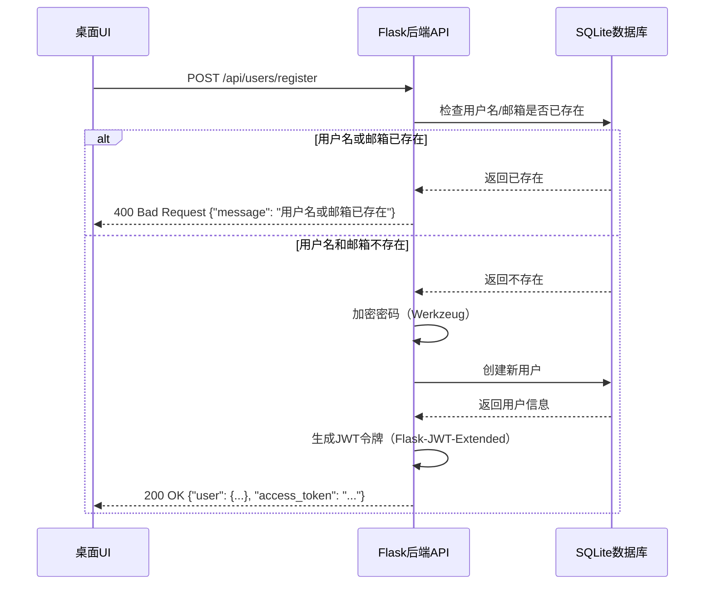
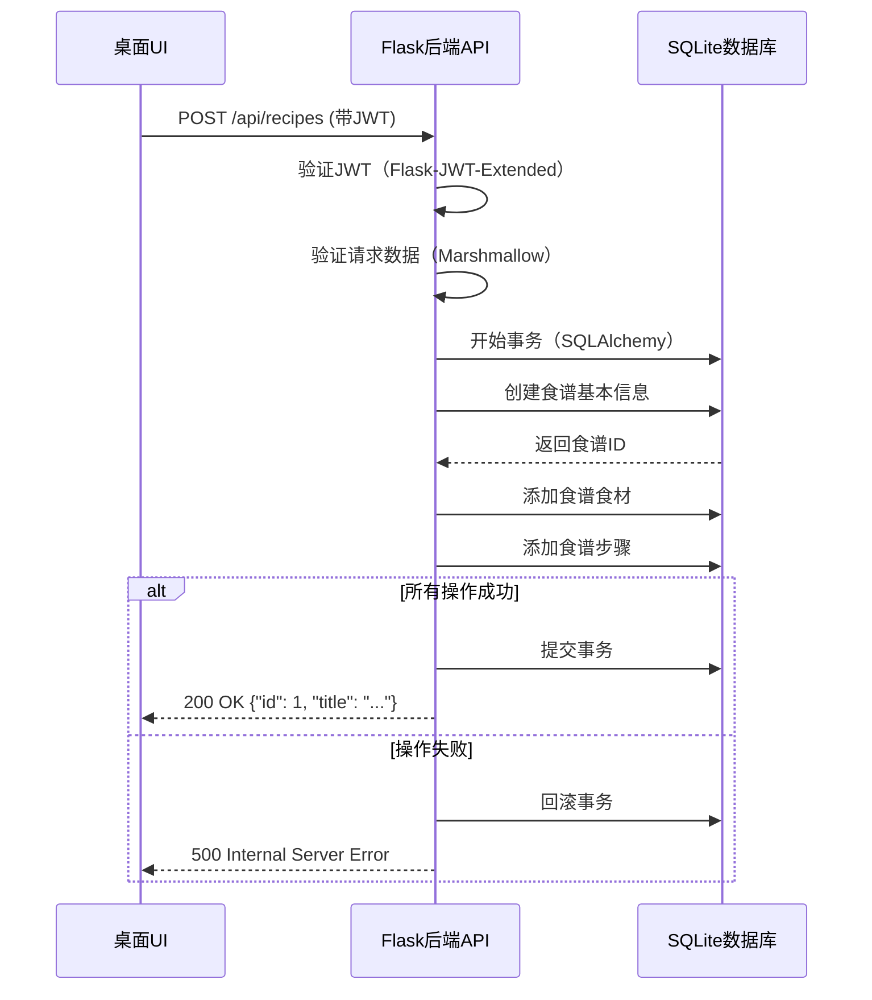
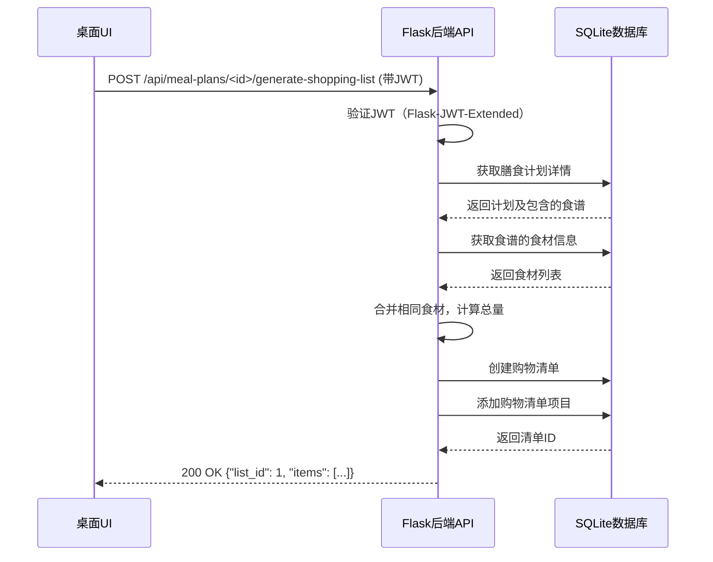
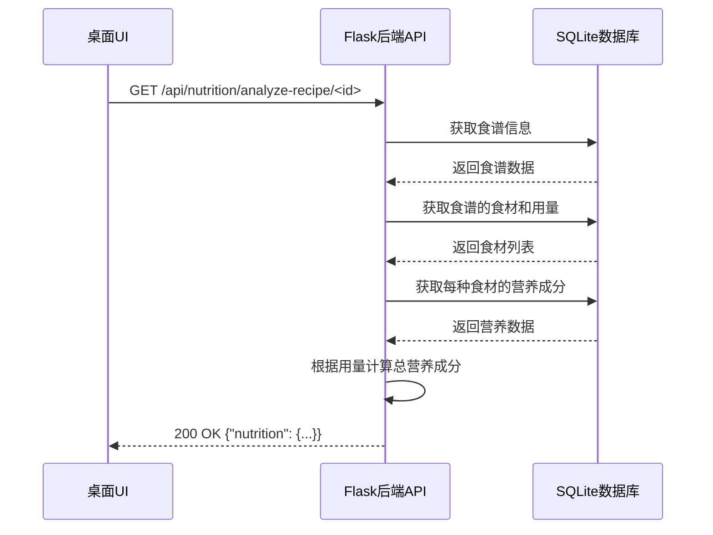
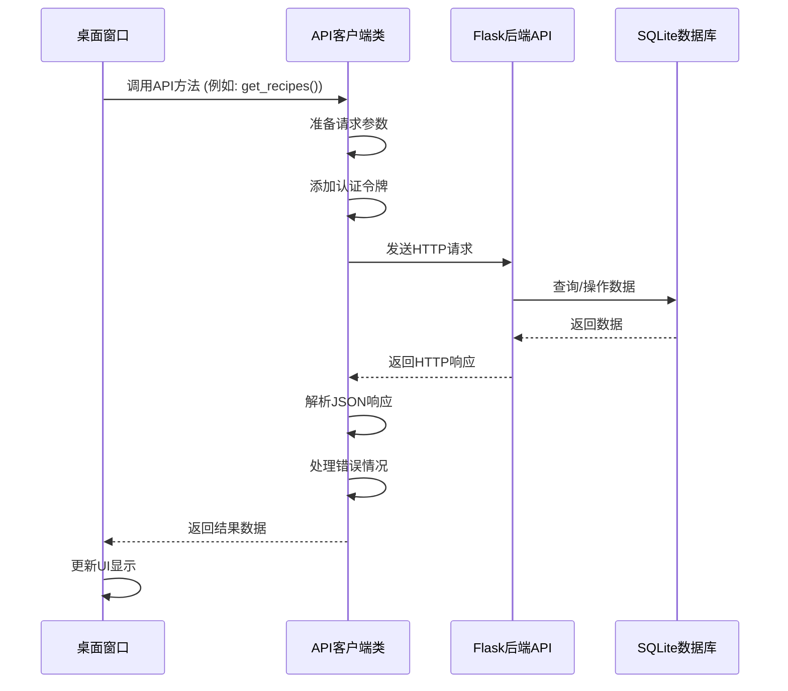
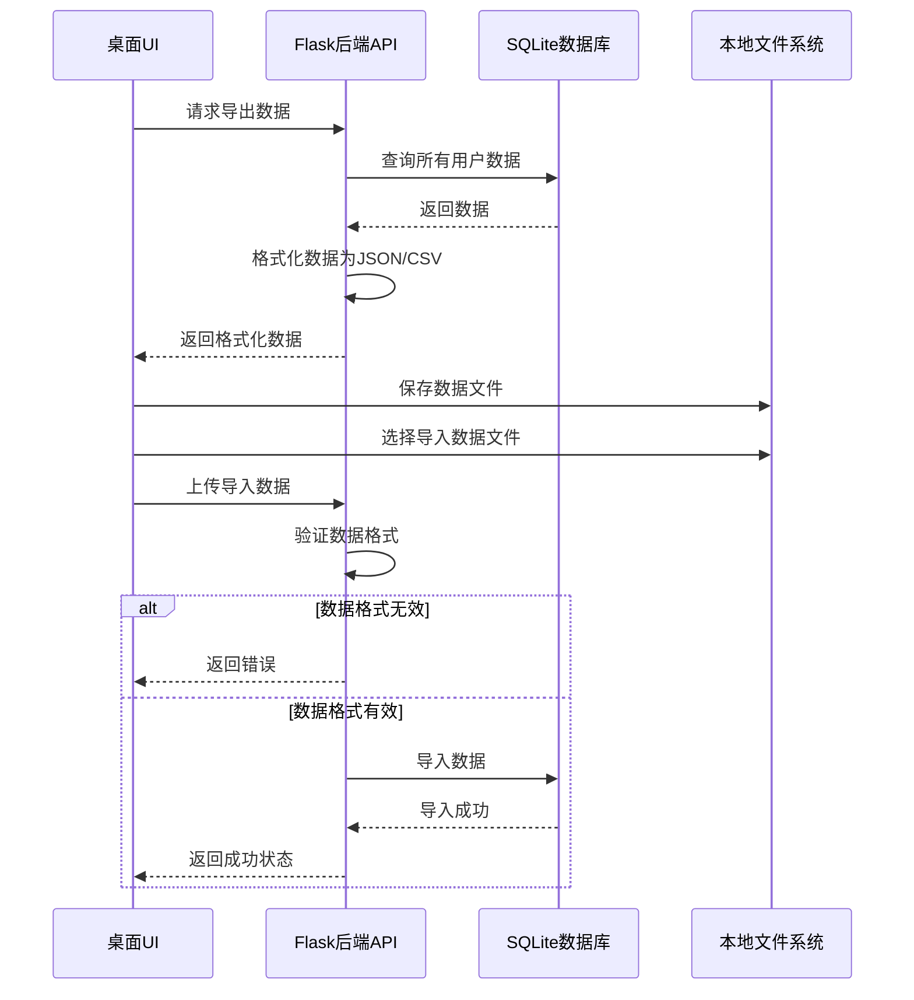
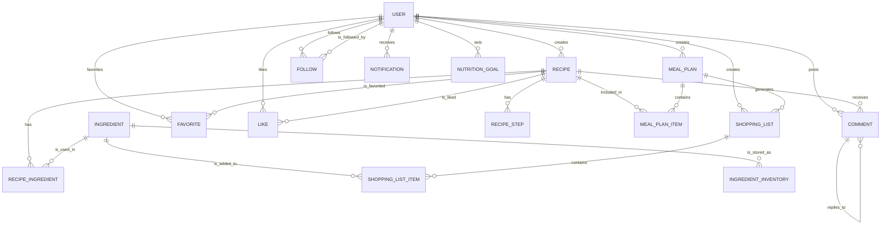

# 家庭食谱与膳食计划应用详细设计文档

## 1. 引言

### 1.1 文档目的
本文档旨在详细描述家庭食谱与膳食计划应用的具体实现细节，包括桌面UI设计、后端API设计、核心业务流程设计、类图设计等内容。本文档将作为开发人员实现系统的具体指导，确保系统实现符合需求规格和概要设计的要求。

### 1.2 术语定义
- **桌面UI**：用户直接交互的界面部分，使用PyQt6框架开发
- **后端**：处理业务逻辑和数据存储的本地服务器部分，使用Python和Flask框架开发
- **API**：应用程序编程接口，桌面UI与后端通信的桥梁
- **JWT**：JSON Web Token，用于身份认证的令牌
- **ORM**：对象关系映射，将数据库操作映射为对象操作的技术
- **窗口/组件**：桌面UI开发中的可复用UI元素
- **服务**：后端开发中处理特定业务逻辑的模块

## 2. 桌面UI设计

### 2.1 技术栈
- **框架**：PyQt6 6.x
- **状态管理**：信号槽机制 + 自定义数据模型
- **导航管理**：QStackedWidget + QTabWidget
- **UI组件库**：PyQt6内置组件
- **HTTP客户端**：QNetworkAccessManager 或 Requests
- **图表库**：PyQt6 Charts 或 Matplotlib
- **多线程**：QThread
- **样式**：QSS (Qt Style Sheets)

### 2.2 目录结构
```
app/
├── assets/            # 静态资源（图片、样式等）
├── components/        # 通用组件
│   ├── common/        # 公共基础组件
│   ├── forms/         # 表单组件
│   └── charts/        # 图表组件
├── models/            # 数据模型
├── services/          # API服务和业务逻辑
├── utils/             # 工具函数
├── windows/           # 窗口类
│   ├── main_window.py     # 主窗口
│   ├── recipe_window.py   # 食谱相关窗口
│   ├── meal_plan_window.py # 膳食计划相关窗口
│   └── profile_window.py  # 用户信息窗口
├── api/               # API客户端
│   ├── client.py      # API客户端基类
│   ├── auth_api.py    # 认证相关API
│   ├── recipe_api.py  # 食谱相关API
│   └── meal_plan_api.py # 膳食计划相关API
├── resources/         # 资源文件
├── app.py             # 应用入口
└── config.py          # 配置文件
```

### 2.3 窗口与组件设计

#### 2.3.1 主窗口组件

##### 2.3.1.1 MainWindow
- **功能**：应用的主窗口，包含菜单栏、工具栏、状态栏和中央内容区域
- **继承**：QMainWindow
- **主要组件**：
  - QMenuBar: 菜单栏
  - QToolBar: 工具栏
  - QStatusBar: 状态栏
  - QDockWidget: 侧边栏
  - QStackedWidget: 中央内容区域的页面切换器
- **方法**：
  - `setup_ui()`: 设置UI组件
  - `setup_connections()`: 设置信号槽连接
  - `show_recipe_list()`: 显示食谱列表
  - `show_meal_plans()`: 显示膳食计划
  - `show_user_profile()`: 显示用户信息
  - `handle_logout()`: 处理用户登出
  - `handle_search()`: 处理搜索功能
  - `show_message()`: 显示消息提示

##### 2.3.1.2 Sidebar
- **功能**：侧边栏，提供功能导航
- **继承**：QDockWidget
- **主要组件**：
  - QListWidget: 导航项列表
- **方法**：
  - `setup_navigation()`: 设置导航项
  - `on_navigation_clicked()`: 处理导航项点击事件
  - `toggle_collapse()`: 切换折叠状态

#### 2.3.2 食谱相关组件

##### 2.3.2.1 RecipeCardWidget
- **功能**：食谱卡片组件，展示食谱的基本信息
- **继承**：QWidget
- **主要组件**：
  - QLabel: 显示食谱图片、标题、基本信息
  - QPushButton: 操作按钮
- **属性**：
  - `recipe`: 食谱数据对象
- **方法**：
  - `set_recipe_data(recipe)`: 设置食谱数据
  - `setup_ui()`: 设置UI组件
  - `on_view_details()`: 查看详情
  - `on_favorite_toggled()`: 切换收藏状态
- **信号**：
  - `view_requested(recipe_id)`: 请求查看详情
  - `favorite_changed(recipe_id, is_favorite)`: 收藏状态变更

##### 2.3.2.2 RecipeDetailWindow
- **功能**：食谱详情窗口，展示食谱的详细信息
- **继承**：QDialog 或 QMainWindow
- **主要组件**：
  - QLabel: 显示食谱图片、标题、描述
  - QTableWidget: 显示食材列表
  - QListWidget: 显示步骤列表
  - QChartView: 显示营养分析图表
- **属性**：
  - `recipe_id`: 食谱ID
- **方法**：
  - `load_recipe_data()`: 加载食谱数据
  - `update_ui()`: 更新UI显示
  - `on_add_to_plan()`: 添加到膳食计划
  - `on_like_clicked()`: 处理点赞
  - `on_favorite_clicked()`: 处理收藏

##### 2.3.2.3 MealPlanCalendarWidget
- **功能**：膳食计划日历组件，用于查看和管理膳食计划
- **继承**：QWidget
- **主要组件**：
  - QCalendarWidget: 日历控件
  - QTableWidget: 显示餐次信息
  - QPushButton: 操作按钮
- **属性**：
  - `view_mode`: 视图类型（日、周、月）
  - `current_date`: 当前日期
- **方法**：
  - `load_plan_data(date)`: 加载指定日期的计划
  - `add_meal_to_plan()`: 添加餐次
  - `update_meal_in_plan(meal_id, data)`: 更新餐次
  - `remove_meal_from_plan(meal_id)`: 删除餐次
  - `switch_view_mode(mode)`: 切换视图模式
- **信号**：
  - `plan_updated(plan_id)`: 计划已更新

##### 2.3.2.4 ShoppingListWidget
- **功能**：食材清单组件，展示和管理采购清单
- **继承**：QWidget
- **主要组件**：
  - QTableWidget: 显示清单商品
  - QPushButton: 操作按钮
- **属性**：
  - `list_id`: 清单ID
- **方法**：
  - `load_list_data()`: 加载清单数据
  - `toggle_item_status(item_id)`: 切换商品购买状态
  - `add_item_to_list()`: 添加商品
  - `remove_item_from_list(item_id)`: 删除商品
  - `generate_from_plan(plan_id)`: 从膳食计划生成清单
- **信号**：
  - `list_updated(list_id)`: 清单已更新

##### 2.3.2.5 NutritionChartWidget
- **功能**：营养分析图表组件，展示营养数据的可视化图表
- **继承**：QWidget
- **主要组件**：
  - QChartView: 图表显示控件
  - QComboBox: 图表类型选择
- **属性**：
  - `nutrition_data`: 营养数据对象
  - `chart_type`: 图表类型（饼图、柱状图、雷达图）
- **方法**：
  - `init_chart()`: 初始化图表
  - `update_chart(data)`: 更新图表数据
  - `change_chart_type(type)`: 切换图表类型
- **依赖**：PyQt6 Charts 或 Matplotlib

### 2.4 窗口设计

#### 2.4.1 首页窗口
- **功能**：展示热门食谱、推荐内容、快速入口等
- **主要组件**：
  - RecipeCardWidget: 食谱卡片列表
  - QTabWidget: 分类导航
  - BannerWidget: 横幅展示
- **主要操作**：
  - 浏览热门食谱
  - 快速进入各功能模块
  - 搜索食谱

#### 2.4.2 食谱列表窗口
- **功能**：展示食谱列表，支持筛选和排序
- **主要组件**：
  - QTableView/QListWidget: 食谱列表
  - FilterWidget: 筛选面板
  - PaginationWidget: 分页控件
- **主要操作**：
  - 浏览食谱列表
  - 按条件筛选和排序
  - 查看食谱详情
  - 创建新食谱

#### 2.4.3 食谱详情窗口
- **功能**：展示食谱的详细信息
- **主要组件**：
  - RecipeDetailWidget: 食谱详情内容
  - NutritionChartWidget: 营养分析图表
  - CommentWidget: 评论区域
- **主要操作**：
  - 查看食谱详细信息
  - 分析营养成分
  - 添加到收藏
  - 添加到膳食计划

#### 2.4.4 创建/编辑食谱窗口
- **功能**：创建或编辑食谱
- **主要组件**：
  - RecipeFormWidget: 食谱表单
  - IngredientSelectorWidget: 食材选择器
  - StepEditorWidget: 步骤编辑器
- **主要操作**：
  - 填写食谱基本信息
  - 添加食材和用量
  - 添加烹饪步骤
  - 上传图片

#### 2.4.5 膳食计划窗口
- **功能**：查看和管理膳食计划
- **主要组件**：
  - MealPlanCalendarWidget: 膳食计划日历
  - PlanListWidget: 计划列表
- **主要操作**：
  - 创建膳食计划
  - 编辑计划中的餐次
  - 生成购物清单

#### 2.4.6 食材清单窗口
- **功能**：查看和管理购物清单
- **主要组件**：
  - ShoppingListWidget: 购物清单
- **主要操作**：
  - 查看购物清单
  - 标记已购买商品
  - 添加/删除商品
  - 从膳食计划生成清单

#### 2.4.7 用户信息窗口
- **功能**：管理用户个人信息和健康信息
- **主要组件**：
  - ProfileFormWidget: 个人信息表单
  - HealthInfoFormWidget: 健康信息表单
- **主要操作**：
  - 更新个人信息
  - 设置健康目标
  - 管理饮食偏好

#### 2.4.8 数据管理窗口
- **功能**：管理本地数据，包括备份、恢复、导出导入
- **主要组件**：
  - QPushButton: 操作按钮
  - QFileDialog: 文件选择对话框
- **主要操作**：
  - 备份数据
  - 恢复数据
  - 导出数据
  - 导入数据

### 2.5 数据模型与状态管理

#### 2.5.1 用户数据模型（UserData）
- **属性**:
  - `user_id`: 用户ID
  - `username`: 用户名
  - `email`: 邮箱
  - `avatar`: 头像
  - `is_logged_in`: 是否已登录
  - `auth_token`: 认证令牌
  - `health_info`: 健康信息
- **方法**:
  - `login(credentials)`: 用户登录
  - `logout()`: 用户登出
  - `update_profile(data)`: 更新用户信息
  - `load_user_info()`: 加载用户信息
- **信号**:
  - `login_status_changed(is_logged_in)`: 登录状态变更
  - `profile_updated()`: 个人信息已更新

#### 2.5.2 食谱数据模型（RecipeData）
- **属性**:
  - `recipe_list`: 食谱列表
  - `current_recipe`: 当前查看的食谱
  - `filters`: 筛选条件
  - `pagination`: 分页信息
- **方法**:
  - `fetch_recipes(params)`: 获取食谱列表
  - `fetch_recipe_detail(id)`: 获取食谱详情
  - `create_recipe(data)`: 创建食谱
  - `update_recipe(id, data)`: 更新食谱
  - `delete_recipe(id)`: 删除食谱
  - `favorite_recipe(id)`: 收藏食谱
- **信号**:
  - `recipes_loaded()`: 食谱列表已加载
  - `recipe_detail_loaded()`: 食谱详情已加载
  - `recipe_updated(recipe_id)`: 食谱已更新

#### 2.5.3 膳食计划数据模型（MealPlanData）
- **属性**:
  - `plan_list`: 膳食计划列表
  - `current_plan`: 当前查看的计划
  - `view_mode`: 视图模式（日/周/月）
- **方法**:
  - `fetch_plans(params)`: 获取膳食计划列表
  - `fetch_plan_detail(id)`: 获取膳食计划详情
  - `create_plan(data)`: 创建膳食计划
  - `update_plan(id, data)`: 更新膳食计划
  - `delete_plan(id)`: 删除膳食计划
  - `add_meal_to_plan(plan_id, meal)`: 向计划添加餐次
- **信号**:
  - `plans_loaded()`: 计划列表已加载
  - `plan_updated(plan_id)`: 计划已更新

#### 2.5.4 营养数据模型（NutritionData）
- **属性**:
  - `nutrition_goals`: 营养目标
  - `current_nutrition`: 当前营养分析结果
- **方法**:
  - `fetch_nutrition_goals()`: 获取营养目标
  - `update_nutrition_goals(data)`: 更新营养目标
  - `analyze_recipe_nutrition(recipe_id)`: 分析食谱营养
  - `analyze_plan_nutrition(plan_id)`: 分析计划营养
- **信号**:
  - `nutrition_goals_updated()`: 营养目标已更新
  - `nutrition_analyzed()`: 营养分析完成

## 3. 后端设计

### 3.1 技术栈
- **语言**：Python 3.9+
- **框架**：Flask 2.x
- **数据库**：SQLite 3.x
- **ORM**：SQLAlchemy 2.x
- **认证**：Flask-JWT-Extended
- **数据验证**：Flask-WTF / Marshmallow
- **日志**：Python logging
- **API文档**：Flask-RESTX

### 3.2 目录结构
```
backend/
├── config/            # 配置文件
│   ├── __init__.py
│   └── settings.py    # 应用设置
├── controllers/       # 控制器（处理请求）
│   ├── __init__.py
│   ├── auth_controller.py
│   ├── recipe_controller.py
│   ├── meal_plan_controller.py
│   └── nutrition_controller.py
├── models/            # 数据模型
│   ├── __init__.py
│   ├── base.py        # 基础模型
│   ├── user.py
│   ├── recipe.py
│   ├── meal_plan.py
│   └── nutrition.py
├── routes/            # 路由配置
│   ├── __init__.py
│   ├── auth_routes.py
│   ├── recipe_routes.py
│   ├── meal_plan_routes.py
│   └── nutrition_routes.py
├── services/          # 业务逻辑层
│   ├── __init__.py
│   ├── auth_service.py
│   ├── recipe_service.py
│   ├── meal_plan_service.py
│   └── nutrition_service.py
├── utils/             # 工具函数
│   ├── __init__.py
│   ├── security.py     # 安全相关工具
│   ├── validation.py  # 数据验证工具
│   └── response.py    # 响应格式化工具
├── database/          # 数据库相关
│   ├── __init__.py
│   ├── engine.py      # 数据库引擎
│   └── migrations/    # 数据库迁移
├── api/               # API定义
│   ├── __init__.py
│   └── schemas/       # 请求响应模式
├── app.py             # Flask应用实例
├── run.py             # 服务器入口文件
└── requirements.txt   # 依赖列表

### 3.3 类设计

#### 3.3.1 用户相关类

##### 3.3.1.1 UserService
- **功能**：处理用户相关的业务逻辑
- **方法**：
  - `register(data)`: 注册新用户
  - `login(credentials)`: 用户登录
  - `getUserById(id)`: 根据ID获取用户信息
  - `updateUser(id, data)`: 更新用户信息
  - `updateHealthInfo(id, data)`: 更新健康信息
  - `resetPassword(email)`: 重置密码
- **依赖**：`UserModel`, `PasswordService`, `EmailService`

##### 3.3.1.2 AuthService
- **功能**：处理认证相关的业务逻辑
- **方法**：
  - `generateToken(user)`: 生成JWT令牌
  - `verifyToken(token)`: 验证JWT令牌
  - `refreshToken(token)`: 刷新令牌
  - `hashPassword(password)`: 密码加密
  - `verifyPassword(plainPassword, hashedPassword)`: 密码验证
- **依赖**：`jsonwebtoken`, `bcrypt`

#### 3.3.2 食谱相关类

##### 3.3.2.1 RecipeService
- **功能**：处理食谱相关的业务逻辑
- **方法**：
  - `createRecipe(userId, data)`: 创建食谱
  - `getRecipeById(id)`: 获取食谱详情
  - `updateRecipe(id, data)`: 更新食谱
  - `deleteRecipe(id)`: 删除食谱
  - `getRecipes(params)`: 获取食谱列表
  - `searchRecipes(keyword, params)`: 搜索食谱
  - `getPopularRecipes(limit)`: 获取热门食谱
- **依赖**：`RecipeModel`, `RecipeIngredientModel`, `RecipeStepModel`

##### 3.3.2.2 RecipeSearchService
- **功能**：处理食谱搜索的业务逻辑
- **方法**：
  - `searchByKeyword(keyword)`: 按关键词搜索
  - `searchByIngredients(ingredientIds)`: 按食材搜索
  - `searchByCategory(categoryId)`: 按分类搜索
  - `filterRecipes(filters)`: 按条件筛选
- **依赖**：`RecipeModel`, `RecipeCategoryModel`

#### 3.3.3 膳食计划相关类

##### 3.3.3.1 MealPlanService
- **功能**：处理膳食计划相关的业务逻辑
- **方法**：
  - `createPlan(userId, data)`: 创建膳食计划
  - `getPlanById(id)`: 获取计划详情
  - `updatePlan(id, data)`: 更新计划
  - `deletePlan(id)`: 删除计划
  - `getUserPlans(userId, params)`: 获取用户的计划列表
  - `addMealToPlan(planId, meal)`: 向计划添加餐次
  - `updateMealInPlan(mealId, data)`: 更新计划中的餐次
  - `removeMealFromPlan(mealId)`: 从计划中移除餐次
- **依赖**：`MealPlanModel`, `MealPlanItemModel`

##### 3.3.3.2 ShoppingListService
- **功能**：处理食材清单相关的业务逻辑
- **方法**：
  - `createList(userId, data)`: 创建食材清单
  - `generateListFromPlan(planId)`: 根据膳食计划生成食材清单
  - `getListById(id)`: 获取清单详情
  - `updateList(id, data)`: 更新清单
  - `deleteList(id)`: 删除清单
  - `addItemToList(listId, item)`: 向清单添加商品
  - `updateItemInList(itemId, data)`: 更新清单中的商品
  - `removeItemFromList(itemId)`: 从清单中移除商品
- **依赖**：`ShoppingListModel`, `ShoppingListItemModel`, `MealPlanService`

#### 3.3.4 营养分析相关类

##### 3.3.4.1 NutritionService
- **功能**：处理营养分析相关的业务逻辑
- **方法**：
  - `analyzeRecipeNutrition(recipeId)`: 分析食谱营养
  - `analyzeMealNutrition(meal)`: 分析餐次营养
  - `analyzePlanNutrition(planId)`: 分析计划营养
  - `calculateDailyIntake(userId, date)`: 计算每日摄入量
  - `getNutritionGoals(userId)`: 获取营养目标
  - `updateNutritionGoals(userId, data)`: 更新营养目标
- **依赖**：`RecipeModel`, `IngredientModel`, `NutritionGoalModel`

### 3.4 API 设计

#### 3.4.1 用户API

##### 3.4.1.1 用户注册
- **URL**: `/api/users/register`
- **方法**: `POST`
- **请求体**: 
  ```json
  {
    "username": "string",
    "password": "string",
    "email": "string",
    "phone": "string"
  }
  ```
- **响应**: 
  ```json
  {
    "code": 200,
    "message": "success",
    "data": {
      "user": {
        "id": 1,
        "username": "string",
        "email": "string",
        "phone": "string"
      },
      "token": "string"
    }
  }
  ```

##### 3.4.1.2 用户登录
- **URL**: `/api/users/login`
- **方法**: `POST`
- **请求体**: 
  ```json
  {
    "email": "string",
    "password": "string"
  }
  ```
- **响应**: 
  ```json
  {
    "code": 200,
    "message": "success",
    "data": {
      "user": {
        "id": 1,
        "username": "string",
        "email": "string"
      },
      "token": "string"
    }
  }
  ```

##### 3.4.1.3 获取用户信息
- **URL**: `/api/users/profile`
- **方法**: `GET`
- **认证**: `JWT`
- **响应**: 
  ```json
  {
    "code": 200,
    "message": "success",
    "data": {
      "id": 1,
      "username": "string",
      "email": "string",
      "phone": "string",
      "avatar": "string",
      "gender": "male",
      "age": 25,
      "height": 175,
      "weight": 70
    }
  }
  ```

##### 3.4.1.4 更新用户信息
- **URL**: `/api/users/profile`
- **方法**: `PUT`
- **认证**: `JWT`
- **请求体**: 
  ```json
  {
    "username": "string",
    "avatar": "string",
    "gender": "male",
    "age": 25
  }
  ```
- **响应**: 
  ```json
  {
    "code": 200,
    "message": "success",
    "data": {
      "id": 1,
      "username": "string",
      "avatar": "string",
      "gender": "male",
      "age": 25
    }
  }
  ```

#### 3.4.2 食谱API

##### 3.4.2.1 获取食谱列表
- **URL**: `/api/recipes`
- **方法**: `GET`
- **查询参数**: 
  - `page`: 页码（默认：1）
  - `pageSize`: 每页条数（默认：10）
  - `category`: 分类ID
  - `difficulty`: 难度（easy, medium, hard）
  - `sort_by`: 排序字段（created_at, view_count, like_count）
  - `sort_order`: 排序顺序（asc, desc）
- **响应**: 
  ```json
  {
    "code": 200,
    "message": "success",
    "data": {
      "recipes": [
        {
          "id": 1,
          "title": "红烧肉",
          "cover_image": "string",
          "prep_time": 15,
          "cook_time": 60,
          "servings": 4,
          "difficulty": "medium",
          "view_count": 100,
          "like_count": 50,
          "created_at": "2023-01-01T00:00:00Z"
        }
      ],
      "pagination": {
        "page": 1,
        "page_size": 10,
        "total": 100,
        "total_pages": 10
      }
    }
  }
  ```

##### 3.4.2.2 获取食谱详情
- **URL**: `/api/recipes/<id>`
- **方法**: `GET`
- **响应**: 
  ```json
  {
    "code": 200,
    "message": "success",
    "data": {
      "id": 1,
      "title": "红烧肉",
      "description": "string",
      "cover_image": "string",
      "prep_time": 15,
      "cook_time": 60,
      "servings": 4,
      "difficulty": "medium",
      "ingredients": [
        {
          "id": 1,
          "name": "五花肉",
          "quantity": 500,
          "unit": "g"
        }
      ],
      "steps": [
        {
          "step_number": 1,
          "description": "将五花肉切成块状"
        }
      ],
      "nutrition": {
        "calories": 500,
        "protein": 20,
        "fat": 30,
        "carbohydrate": 10
      },
      "view_count": 100,
      "like_count": 50,
      "created_at": "2023-01-01T00:00:00Z"
    }
  }
  ```

##### 3.4.2.3 创建食谱
- **URL**: `/api/recipes`
- **方法**: `POST`
- **认证**: `JWT`
- **请求体**: 
  ```json
  {
    "title": "红烧肉",
    "description": "string",
    "prep_time": 15,
    "cook_time": 60,
    "servings": 4,
    "difficulty": "medium",
    "ingredients": [
      {
        "ingredient_id": 1,
        "name": "五花肉",
        "quantity": 500,
        "unit": "g"
      }
    ],
    "steps": [
      {
        "step_number": 1,
        "description": "将五花肉切成块状"
      }
    ],
    "is_public": true
  }
  ```
- **响应**: 
  ```json
  {
    "code": 200,
    "message": "success",
    "data": {
      "id": 1,
      "title": "红烧肉",
      "createdAt": "2023-01-01T00:00:00Z"
    }
  }
  ```

#### 3.4.3 膳食计划API

##### 3.4.3.1 创建膳食计划
- **URL**: `/api/meal-plans`
- **方法**: `POST`
- **认证**: `JWT`
- **请求体**: 
  ```json
  {
    "title": "一周晚餐计划",
    "start_date": "2023-01-01",
    "end_date": "2023-01-07",
    "plan_type": "week",
    "items": [
      {
        "meal_date": "2023-01-01",
        "meal_type": "dinner",
        "recipe_id": 1
      }
    ]
  }
  ```
- **响应**: 
  ```json
  {
    "code": 200,
    "message": "success",
    "data": {
      "id": 1,
      "title": "一周晚餐计划",
      "createdAt": "2023-01-01T00:00:00Z"
    }
  }
  ```

##### 3.4.3.2 获取膳食计划详情
- **URL**: `/api/meal-plans/<id>`
- **方法**: `GET`
- **认证**: `JWT`
- **响应**: 
  ```json
  {
    "code": 200,
    "message": "success",
    "data": {
      "id": 1,
      "title": "一周晚餐计划",
      "start_date": "2023-01-01",
      "end_date": "2023-01-07",
      "items": [
        {
          "id": 1,
          "meal_date": "2023-01-01",
          "meal_type": "dinner",
          "recipe": {
            "id": 1,
            "title": "红烧肉"
          }
        }
      ]
    }
  }
  ```

##### 3.4.3.3 生成购物清单
- **URL**: `/api/meal-plans/<id>/generate-shopping-list`
- **方法**: `POST`
- **认证**: `JWT`
- **响应**: 
  ```json
  {
    "code": 200,
    "message": "success",
    "data": {
      "list_id": 1,
      "title": "购物清单（2023-01-01至2023-01-07）",
      "items": [
        {
          "name": "五花肉",
          "quantity": 1000,
          "unit": "g"
        }
      ]
    }
  }
  ```

#### 3.4.4 营养分析API

##### 3.4.4.1 分析食谱营养
- **URL**: `/api/nutrition/analyze-recipe/<recipe_id>`
- **方法**: `GET`
- **响应**: 
  ```json
  {
    "code": 200,
    "message": "success",
    "data": {
      "recipe_id": 1,
      "recipe_title": "红烧肉",
      "nutrition": {
        "calories": 500,
        "protein": 20,
        "fat": 30,
        "carbohydrate": 10,
        "fiber": 2,
        "vitamins": {
          "A": 100,
          "C": 50
        },
        "minerals": {
          "calcium": 20,
          "iron": 5
        }
      }
    }
  }
  ```

##### 3.4.4.2 设置营养目标
- **URL**: `/api/nutrition/goals`
- **方法**: `PUT`
- **认证**: `JWT`
- **请求体**: 
  ```json
  {
    "daily_calories": 2000,
    "daily_protein": 100,
    "daily_fat": 60,
    "daily_carbohydrate": 250,
    "daily_fiber": 25
  }
  ```
- **响应**: 
  ```json
  {
    "code": 200,
    "message": "success",
    "data": {
      "daily_calories": 2000,
      "daily_protein": 100,
      "daily_fat": 60,
      "daily_carbohydrate": 250,
      "daily_fiber": 25
    }
  }
  ```

## 4. 核心业务流程设计

### 4.1 用户注册流程



### 4.2 创建食谱流程



### 4.3 生成购物清单流程



### 4.4 营养分析流程



### 4.5 桌面UI与后端通信流程



### 4.6 本地数据同步流程



## 5. 数据模型关系图



## 6. 安全性设计

### 6.1 认证与授权
- 使用JWT进行用户认证，设置合理的过期时间
- 实现基于角色的访问控制（RBAC）
- 敏感操作（如删除、更新）需要验证用户权限
- 防止水平越权访问，确保用户只能访问自己的数据

### 6.2 数据验证
- 前端表单验证，提供即时反馈
- 后端API参数验证，使用验证中间件
- 对所有用户输入进行过滤和转义，防止XSS攻击
- 使用参数化查询，防止SQL注入

### 6.3 数据加密
- 用户密码使用bcrypt进行加密存储
- 敏感数据（如健康信息）在数据库中加密存储
- 使用HTTPS协议加密传输数据
- 加密用户会话数据，防止会话劫持

### 6.4 防护措施
- 实现请求限流，防止暴力攻击
- 添加CSRF保护机制
- 定期清理用户会话
- 记录安全日志，监控异常操作

## 7. 性能优化策略

### 7.1 前端优化
- 使用懒加载技术，减少初始加载时间
- 组件化开发，提高代码复用性
- 图片优化，使用适当的格式和大小
- 使用缓存策略，减少重复请求
- 代码分割，按需加载模块

### 7.2 后端优化
- 使用连接池管理数据库连接
- 实现数据缓存，使用Redis缓存热点数据
- 优化数据库查询，添加适当的索引
- 使用异步处理，提高并发性能
- 实现请求批处理，减少API调用次数

### 7.3 数据库优化
- 数据库索引优化，提高查询效率
- 合理设计表结构，减少数据冗余
- 定期清理无效数据，优化存储空间
- 考虑读写分离，分担数据库负载
- 对大数据量的查询进行分页处理

## 8. 测试策略

### 8.1 单元测试
- 测试范围：核心业务逻辑、工具函数、模型方法
- 测试工具：pytest（后端）、pytest-qt（PyQt6前端）
- 覆盖率要求：核心代码覆盖率达到80%以上

### 8.2 集成测试
- 测试范围：API接口、前后端交互、数据库操作
- 测试工具：Flask-Testing（API测试）、pytest-qt（端到端测试）
- 重点测试：数据流转的正确性、错误处理的有效性

### 8.3 性能测试
- 测试指标：响应时间、资源使用率、数据处理能力
- 测试工具：Python性能分析工具、SQLite性能分析
- 测试场景：本地数据处理性能、UI响应速度

### 8.4 安全测试
- 测试内容：认证授权、数据加密、SQL注入防护
- 测试方法：静态代码分析、安全检查
- 工具：Bandit（Python安全扫描）、自定义安全测试

## 9. 部署与运维

### 9.1 部署架构
- 使用PyInstaller或cx_Freeze打包为桌面应用
- 本地安装部署，包含Python解释器、Flask服务和SQLite数据库
- 内嵌Flask服务器，无需外部Web服务器
- 本地SQLite数据库存储，无需额外数据库服务器
- 可选Docker容器化部署用于开发测试环境

### 9.2 CI/CD流程
- 使用GitHub Actions自动化构建和测试
- 代码提交后自动运行单元测试和集成测试
- 测试通过后自动构建应用安装包
- 根据环境（开发/测试/生产）构建不同版本

### 9.3 监控与告警
- 本地应用日志记录，使用Python logging模块
- 关键操作和错误日志本地存储
- 用户操作行为统计
- 可选的远程监控方案（适用于企业版）

### 9.4 容灾备份
- SQLite数据库定期自动备份
- 用户手动备份与恢复功能
- 备份数据本地存储或云端存储
- 导出/导入数据功能

## 10. 扩展与维护

### 10.1 扩展策略
- 模块化设计，支持功能组件的动态加载
- 插件系统，允许第三方功能扩展
- 本地API设计，支持应用内部模块通信
- 数据导出/导入接口，支持与其他应用集成

### 10.2 维护计划
- 定期更新Python依赖包，修复安全漏洞
- 优化PyQt6界面性能和SQLite数据库查询
- 收集用户反馈，持续改进功能
- 定期进行代码审查和重构

### 10.3 文档维护
- 保持Flask API文档的更新与同步
- 记录系统变更日志
- 维护用户手册和开发文档
- 建立知识库，沉淀技术经验